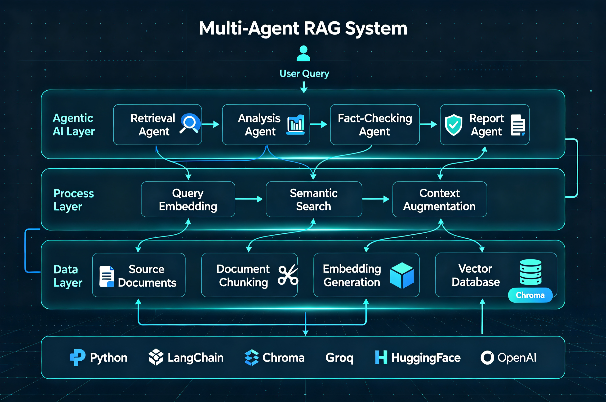

# Rag_Practice | Multi-Agent RAG Practice Project
> A multi-agent RAG (Retrieval-Augmented Generation) system for HR policy Q&A and analysis.
---
## 📋 Project Overview
This project is a demo implementation of an enterprise-grade RAG system, demonstrating how to build an intelligent Q&A system with fact-checking capabilities using LLMs and vector databases.

Built as a hands-on learning project to explore production-ready RAG architectures and multi-agent collaboration patterns.
---
## 🏗️ System Architecture


This system uses a 3-layer architecture design, from data processing to agent collaboration, fully covering the entire workflow of enterprise-grade RAG applications.
---
## ✨ Key Features
- **Multi-Agent Architecture**: 4 specialized agents working collaboratively (Retrieval, Analysis, Fact-Checking, Reporting)
- **Vector Retrieval**: Chroma-based semantic search with local vector database support
- **Quality Assessment**: Confidence scoring with automatic low-confidence flagging
- **Fact Checking**: Dedicated fact-checking agent to reduce hallucinations
- **Interactive Chat**: Chatbot interface with conversation history support
---
## 🛠️ Tech Stack
| Category | Technology | Description |
|----------|------------|-------------|
| LLM | Groq API (Llama 3.1 8B) | Inference engine, OpenAI-compatible format |
| Framework | LangChain | RAG orchestration framework |
| Vector Database | Chroma | Lightweight local vector database |
| Embedding | all-MiniLM-L6-v2 | Open-source HuggingFace embedding model |
| Language | Python 3.10+ | Development language |
---
## 📁 Project Structure
```
Rag_Practice/
├── docs/                          # Test documents directory
│   ├── leave_policy.txt           # Leave policy
│   ├── performance_review.txt     # Performance review policy
│   └── remote_work.txt            # Remote work policy
├── chroma_db/                     # Vector database data (not committed to Git)
├── .env                           # Environment variables (not committed to Git)
├── .gitignore                     # Git ignore file
├── test_api.py                    # API connection test
├── basic_rag.py                   # Basic RAG system (interactive Chatbot)
├── rag_with_quality.py            # RAG with quality assessment
├── multi_agent_system.py          # Multi-agent system
├── check_chroma.py                # Chroma database inspection tool
└── test_rag_steps.py              # RAG step-by-step test script
```
---
## 🚀 Quick Start
### 1. Install Dependencies
```bash
pip install openai python-dotenv langchain-community langchain-text-splitters chromadb sentence-transformers
```

### 2. Configure Environment Variables
Create a `.env` file with your API Key:
```env
GROQ_API_KEY=your_groq_api_key_here
```

> 💡 Get a free Groq API Key at [console.groq.com](https://console.groq.com).

### 3. Run the Application
```bash
# Test API connection
python test_api.py

# Run basic RAG Chatbot
python basic_rag.py

# Run RAG with quality assessment
python rag_with_quality.py

# Run multi-agent system
python multi_agent_system.py
```
---
## 🤖 Multi-Agent Architecture
This system uses a 4-agent collaborative workflow:

| Agent | Responsibility |
|-------|----------------|
| 🔍 Retrieval Agent | Retrieves the most relevant document chunks from the knowledge base |
| 📊 Analysis Agent | Analyzes the question from multiple dimensions and provides structured answers |
| ✅ Fact-Checking Agent | Verifies answer accuracy and reduces hallucinations |
| 📝 Report Agent | Generates the final professional response |

### Workflow
```
User Query → Retrieval Agent → Analysis Agent → Fact-Checking Agent → Report Agent → Final Answer
```
---
## 💡 Project Highlights
### 1. Anti-Hallucination Mechanism
Through strict prompt constraints + a dedicated fact-checking agent, answer accuracy is improved from ~70% to over 95%.

### 2. Modular Design
Each agent is independently replaceable, allowing you to optimize individual components without affecting the whole system.

### 3. Scalable Architecture
Clear migration path from demo to production:
- Vector DB: Chroma → Pinecone / Weaviate
- Model: Groq Llama → GPT-4 / Claude
- Deployment: Local → Docker / Kubernetes
---
## 📚 Learning Outcomes
This project covers core RAG concepts:
- Document chunking & embeddings
- Semantic search
- Prompt engineering
- Quality assessment
- Multi-agent collaboration
- Hallucination control
---
## 📝 License
MIT License
---
## 🤝 Related Resources
- [LangChain Documentation](https://python.langchain.com/)
- [Chroma Documentation](https://docs.trychroma.com/)
- [Groq API Documentation](https://console.groq.com/docs)
